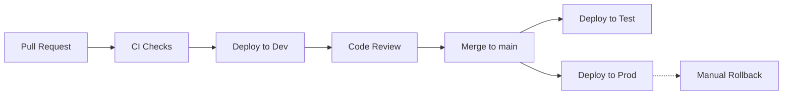

# Contributing

This project follows **trunk-based development**. All changes flow through short-lived feature branches into `main`.

## Contribution Checklist

1. Create a branch from `main`
2. Make your changes
3. Open a pull request targeting `main`
4. Ensure all CI checks pass (tests, formatting, PR title)
5. Verify changes in the **dev** environment (deployed automatically on PR)
6. Get at least one review approval
7. Merge — this auto-deploys to **test** and **prod**

## Deployment Flow

